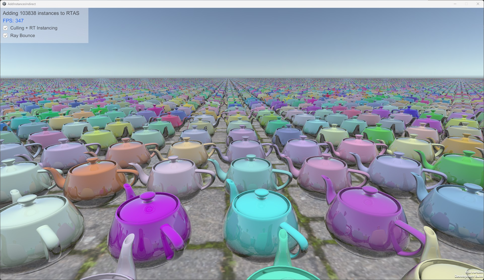

# AddInstancesIndirect
Test project that uses RayTracingAccelerationStructure.AddInstancesIndirect to add many Mesh instances to an acceleration structure.

Function signatures:

```
int RayTracingAccelerationStructure.AddInstancesIndirect(RayTracingMeshInstanceConfig config, GraphicsBuffer instanceMatrices, int maxInstanceCount, GraphicsBuffer argsBuffer, uint argsOffset = 0, uint id = 0xFFFFFFFF);
int RayTracingAccelerationStructure.AddInstancesIndirect(RayTracingGeometryInstanceConfig config, GraphicsBuffer instanceMatrices, int maxInstanceCount, GraphicsBuffer argsBuffer, uint argsOffset = 0, uint id = 0xFFFFFFFF);
```

The instance matrices are provided through a GraphicsBuffer containing Matrix4x4 matrices. The buffer is the output of a GPU culling process driven by a [compute shader](Assets/Shaders/Culling.compute). The compute shader accepts ray tracing instances that are inside a radius around the camera. The amount of ray tracing instances is determined by an indirect arguments GraphicsBuffer which contains 2 integers at an offset: start instance, instance count. In this test, these values are 0 and the amount of instances that passed the culling test.



# Requirements
Unity 6.1 alpha2 +
